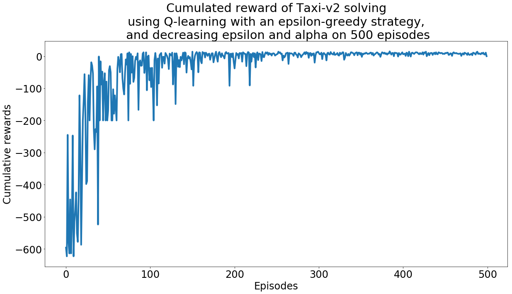

A Q-learning solver applied to the gym environment Taxi-v2.

# Using the code

See the [notebook](notebook.ipynb) for examples of usage.

# Dependency

The environment used is [gym](https://gym.openai.com/), but you can use the module to solve other problems without gym.

# Authors

* Charly Lamothe
* Guillaume Ollier
